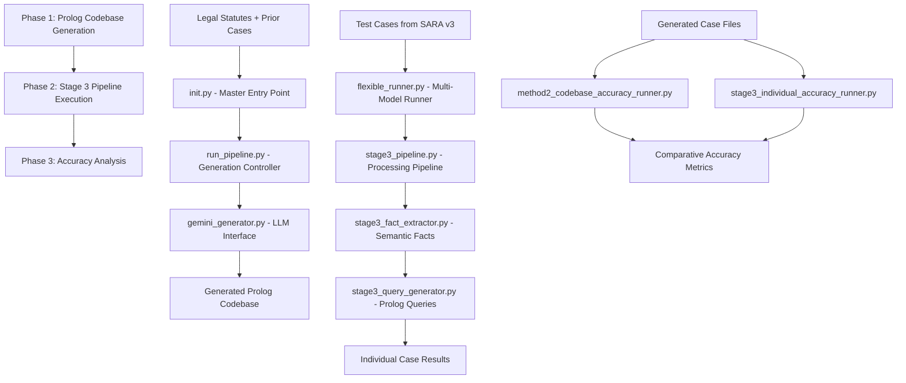

# Method 2 Gemini 2.5 Pro Pipeline

A comprehensive legal reasoning system using Large Language Models to generate Prolog code for statutory interpretation and case analysis. This pipeline converts legal statutes into executable Prolog predicates and processes legal cases through semantic fact extraction and query generation.

## 🏗️ System Architecture

The Method 2 pipeline consists of three main phases:



---

## 📋 Prerequisites

### Environment Setup
```bash
# Required tools
- Python 3.8+
- SWI-Prolog (with 'swipl' in PATH)
- Gemini API key

# Python dependencies
pip install google-generativeai pathlib datetime

# Environment variables
export GEMINI_API_KEY='your_gemini_api_key_here'
```

### Directory Structure
```
method_2_gemini_2.5pro/
├── scripts/                  # 🔧 Core pipeline scripts
├── prolog_codebase/         # 📚 Generated Prolog knowledge base
├── results/                 # 📊 All output files
│   ├── stage3_test_split/   # Stage 3 processing results
│   └── acc_analysis/        # Accuracy testing results
├── cache/                   # ⚡ LLM response caching
└── intermediate_files/      # 🔄 Generation artifacts
```

---

## 🚀 Phase 1: Prolog Codebase Generation

**Purpose**: Convert legal statutes and prior case examples into executable Prolog predicates using LLM-assisted generation.

### Entry Point
```bash
cd scripts/
python init.py
```

### Key Components

#### 1. **init.py** - Master Entry Point
- Environment validation (API keys, SWI-Prolog installation)
- Orchestrates complete pipeline from generation to analysis
- Pre-flight checks for all required files
- Coordinates phases 1 and 2 execution

#### 2. **run_pipeline.py** - Generation Controller
- **PipelineController class**: Main orchestrator for Prolog generation
- **Iterative generation**: Handles multi-turn LLM conversations
- **Smoke testing**: Validates generated Prolog syntax
- **Error recovery**: Attempts to fix problematic files
- **Progress tracking**: Monitors generation success rates

#### 3. **gemini_generator.py** - LLM Interface  
- **API management**: Handles Gemini API communication
- **Prompt management**: Loads and formats generation prompts
- **Response processing**: Manages conversation history
- **Rate limiting**: Prevents API quota exhaustion

#### 4. **prolog_parser.py** - Code Extraction
- **Multi-file parsing**: Extracts Prolog code blocks from LLM responses
- **Syntax validation**: Basic Prolog syntax checking
- **File organization**: Saves parsed files to `prolog_codebase/`

#### 5. **smoke_tester.py** - Quality Assurance
- **Syntax validation**: Tests each generated file with SWI-Prolog
- **Dependency checking**: Ensures module imports work correctly
- **Error reporting**: Provides specific feedback for regeneration

### Generated Outputs
```
prolog_codebase/
├── section1.pl              # Section 1 exemption rules
├── section151.pl            # Section 151 additional exemptions  
├── section152.pl            # Section 152 dependency rules
├── section63.pl             # Section 63 standard deductions
├── helpers.pl               # Utility predicates
├── knowledge_base.pl        # Core facts and rules
└── tests.pl                 # Test cases with answer/2 predicates
```

### Usage Example
```bash
# Full pipeline execution (recommended)
python init.py

# Generation only (advanced users)
python -c "from run_pipeline import PipelineController; PipelineController().run()"
```

---

## ⚡ Phase 2: Stage 3 Pipeline Execution

**Purpose**: Process legal test cases through semantic fact extraction and query generation using the generated Prolog codebase.

### Entry Point - Flexible Multi-Model Runner
```bash
# Basic execution (120 test cases with default model)
python flexible_runner.py

# Advanced usage with model selection
python flexible_runner.py --model gemini-2.5-pro --num-cases 10 --prompt-mode full

# Specific case testing
python flexible_runner.py --cases s151_d_1_pos s151_d_2_neg --model gemini-2.0-flash-exp
```

### Key Components

#### 1. **flexible_runner.py** - Multi-Model Stage 3 Runner ⭐
- **Model switching**: Support for multiple Gemini models (`gemini-2.5-pro`, `gemini-2.0-flash-exp`, etc.)
- **Prompt modes**: Different prompt strategies (`full`, `fast`, `emergency`)
- **Flexible case selection**: Process specific cases or batches
- **Performance monitoring**: Execution timing and success rates
- **Cache integration**: Automatic caching for cost optimization

**Available Models:**
- `gemini-2.5-pro`: Highest quality, slower, more expensive
- `gemini-2.0-flash-exp`: Fast experimental model
- `gemini-1.5-pro`: Balanced performance
- And more... (see `model_config.py`)

#### 2. **stage3_pipeline.py** - Core Processing Pipeline
- **Test case discovery**: Loads cases from `data/sara_v3/splits/test`
- **Batch processing**: Handles 120+ test cases efficiently  
- **Module integration**: Links with Method 2 Prolog codebase
- **Result organization**: Structured output in `results/stage3_test_split/`
- **Progress tracking**: Detailed logging and intermediate saves

#### 3. **stage3_fact_extractor.py** - Semantic Fact Generation
- **Natural language processing**: Converts case text to Prolog facts
- **Method 2 compatibility**: Generates facts compatible with existing predicates
- **Retry logic**: Handles LLM failures gracefully
- **Quality validation**: Ensures minimum fact extraction quality

#### 4. **stage3_query_generator.py** - Prolog Query Generation
- **Question classification**: Distinguishes calculation vs. logic questions
- **Dynamic prompting**: Uses actual codebase context for query generation
- **Answer/2 format**: Generates proper `answer(CaseID, Result)` predicates
- **Type consistency**: Ensures generated queries match question types

#### 5. **stage3_cache_manager.py** - Cost Optimization
- **LLM response caching**: Saves successful results to avoid re-processing
- **Cache management**: Hit rate tracking, selective invalidation
- **Cost savings**: Reduces API usage for repeated runs
- **Resume capabilities**: Continue interrupted processing runs

### Prompt System

#### Dynamic Prompt Generation (**dynamic_prompt_generator.py**)
- **Full mode**: Comprehensive prompts with complete codebase context (88 predicates)
- **Fast mode**: Streamlined prompts for quicker processing  
- **Emergency mode**: Minimal prompts for fallback scenarios
- **Codebase integration**: Injects actual Method 2 predicates into prompts

### Generated Outputs
```
results/stage3_test_split/
├── prolog/                  # Generated .pl files for each case
│   ├── s151_d_1_neg.pl     # Facts + queries ready for execution
│   ├── s151_d_2_pos.pl
│   └── ...                 # 120+ individual case files
└── run_llm_log/            # Execution logs and results
    ├── results_final_*.json       # Complete case results
    ├── summary_final_*.json       # Success rate statistics  
    └── raw_llm_responses_*.json   # LLM debugging information
```

### Model Performance Comparison
```bash
# Compare different models on same cases
python flexible_runner.py --model gemini-2.5-pro --num-cases 5 --output-tag "2.5pro"
python flexible_runner.py --model gemini-2.0-flash-exp --num-cases 5 --output-tag "2.0flash"
```

---

## 🎯 Phase 3: Accuracy Analysis

**Purpose**: Evaluate the logical correctness of generated Prolog code by testing actual vs. expected results across different approaches.

### Entry Points
```bash
# Test Method 2 original approach (26 cases, tests.pl)
python method2_codebase_accuracy_runner.py

# Test Stage 3 individual approach (up to 120 cases, individual files)  
python stage3_individual_accuracy_runner.py

# Test specific number of cases
python stage3_individual_accuracy_runner.py --max-cases 10

# Analyze passed cases without semantic facts
python analyze_passed_cases_without_facts.py
```

### Key Components

#### 1. **shared_accuracy_engine.py** - Core Testing Logic
- **Ground truth determination**: Analyzes case IDs for expected results
  - `_pos` cases → Expected: `true`
  - `_neg` cases → Expected: `false` 
  - `tax_case_X` → Expected: Numeric calculation
- **Prolog execution**: Runs SWI-Prolog with proper module loading
- **Result comparison**: Validates actual vs. expected outcomes
- **SARA compatibility**: Handles both boolean and numeric result types

#### 2. **method2_codebase_accuracy_runner.py** - Original Approach Testing
- **Tests.pl approach**: Uses consolidated file with all `answer/2` predicates
- **26 hardcoded cases**: Focus on core test suite
- **Ground truth sources**:
  - Comments in `tests.pl`
  - Hardcoded expected values for tax calculations
- **Working directory**: `prolog_codebase/`

#### 3. **stage3_individual_accuracy_runner.py** - Stage 3 Approach Testing  
- **Individual file approach**: Tests each generated `.pl` file separately
- **Dynamic case discovery**: Finds all cases in `results/stage3_test_split/prolog/`
- **Temporary consultation**: Creates temp files for SWI-Prolog execution
- **Scalable testing**: Handles 120+ cases efficiently

#### 4. **analyze_passed_cases_without_facts.py** - Fact Extraction Analysis
- **Success pattern analysis**: Identifies which passed cases had no semantic facts extracted
- **Knowledge base effectiveness**: Measures system's ability to succeed using built-in rules alone
- **Fact dependency analysis**: Distinguishes rule-based vs. fact-based reasoning successes
- **Research insights**: Provides data on the role of semantic extraction in overall system performance

### Testing Methodology

#### Ground Truth Logic
```python
# True/False cases (based on case ID)
s151_d_1_pos  → Expected: true   (positive entailment)
s151_d_1_neg  → Expected: false  (negative case)

# Tax calculation cases (SARA expected values)
tax_case_13   → Expected: 4000   (numerical calculation)
tax_case_26   → Expected: 6000   (based on SARA dataset)
```

#### Execution Process
1. **Case file discovery**: Find all `.pl` files or use hardcoded list
2. **Ground truth lookup**: Determine expected result from case ID/comments
3. **Prolog execution**: Run SWI-Prolog with proper module imports
4. **Result parsing**: Extract actual result from Prolog output
5. **Comparison**: Check if actual matches expected (with tolerance for numeric)
6. **Report generation**: Detailed results in JSON and text formats

### Generated Reports
```
results/acc_analysis/
├── method2_codebase_results_*.json              # Method 2 approach detailed results
├── method2_codebase_summary_*.txt               # Method 2 summary report
├── stage3_individual_results_*.json             # Stage 3 approach detailed results  
├── stage3_individual_summary_*.txt              # Stage 3 summary report
├── passed_cases_without_facts_analysis_*.json   # Fact extraction analysis (detailed)
└── passed_cases_without_facts_summary_*.txt     # Fact extraction analysis (summary)
```

#### Sample Accuracy Report
```
🎯 Method 2 Codebase Accuracy Results
====================================
Total cases: 26
Passed: 19 
Success rate: 73.1%

✅ PASSED (19 cases):
- s152_c_1_E_pos: true ✓
- s1_a_1_pos: true ✓  
- tax_case_13: 4000 ✓
...

❌ FAILED (7 cases):
- s1_c_i_neg: Expected false, got PROLOG_ERROR
- s3306_b_10_A_neg: Expected false, got true
...
```

#### Sample Fact Extraction Analysis Report
```
PASSED CASES WITHOUT FACTS ANALYSIS
==================================================
Total passed cases: 48
Passed without facts: 26 (54.2%)
Passed with facts: 22 (45.8%)

KEY FINDING:
🎯 26 out of 48 passed cases (54.2%) succeeded WITHOUT semantic fact extraction.
This suggests the system can rely on built-in knowledge base rules for some cases.

INSIGHT:
More than half of successful cases relied purely on the built-in Prolog
knowledge base rules rather than semantic fact extraction, indicating
robust rule-based reasoning capabilities.
```

---

## 🔧 Configuration & Customization

### Model Configuration (**model_config.py**)
```python
# Switch models for different performance/cost trade-offs
AVAILABLE_MODELS = {
    "gemini-2.5-pro": {
        "display_name": "Gemini 2.5 Pro",
        "context_length": 2000000,
        "cost_tier": "premium"
    },
    "gemini-2.0-flash-exp": {
        "display_name": "Gemini 2.0 Flash Experimental", 
        "context_length": 1000000,
        "cost_tier": "fast"
    }
}
```

### Prompt Customization
- **Full prompts**: Include complete codebase context (88 predicates)
- **Fast prompts**: Streamlined for quicker processing
- **Emergency prompts**: Minimal context for fallback scenarios

### Cache Management
```bash
# View cache statistics
python -c "from stage3_cache_manager import Stage3CacheManager; print(Stage3CacheManager().get_cache_stats())"

# Clear specific cases from cache
python -c "from stage3_cache_manager import Stage3CacheManager; Stage3CacheManager().invalidate_case('s151_d_1_neg')"
```

---

## 📊 Performance Metrics

### Current Benchmark Results
- **Method 2 Codebase**: 73.1% accuracy (26 cases)
- **Stage 3 Pipeline**: 100% generation success, 74.2% execution rate (120 cases)
- **Stage 3 Accuracy**: 40.0% logical accuracy (48/120 cases passed)
- **Fact Extraction Analysis**: 54.2% of passed cases succeeded without semantic facts
- **Processing Speed**: ~5-10 seconds per case (with LLM calls)
- **Cache Performance**: 90%+ hit rate on repeated runs

### Key Performance Indicators
1. **Generation Success Rate**: Percentage of valid Prolog files generated
2. **Execution Rate**: Percentage of files that run without Prolog errors  
3. **Logical Accuracy**: Percentage of cases with correct true/false or numeric results
4. **Fact Dependency Rate**: Percentage of successful cases that required semantic fact extraction
5. **Cache Hit Rate**: Efficiency of caching system

---

## 🚨 Troubleshooting

### Common Issues

#### Phase 1 (Generation)
```bash
# Issue: Missing API key
❌ Error: GEMINI_API_KEY environment variable not set
✅ Solution: export GEMINI_API_KEY='your_key_here'

# Issue: SWI-Prolog not found
❌ Error: SWI-Prolog not found
✅ Solution: Install SWI-Prolog and ensure 'swipl' is in PATH
```

#### Phase 2 (Pipeline)
```bash
# Issue: Model not found
❌ Error: Unknown model 'gemini-invalid'
✅ Solution: Use --list-models to see available models

# Issue: Cache corruption
❌ Error: Cache index corrupted
✅ Solution: Delete cache/ directory and restart
```

#### Phase 3 (Accuracy)
```bash
# Issue: No Prolog files found
❌ Error: No .pl files in results/stage3_test_split/prolog/
✅ Solution: Run Phase 2 first to generate case files

# Issue: Module import errors
❌ Error: add_to_path/1 procedure not found
✅ Solution: Ensure helpers.pl defines all required utility predicates
```

### Debug Mode
```bash
# Enable detailed logging
export LOG_LEVEL=DEBUG
python flexible_runner.py --num-cases 1

# Check raw LLM responses  
cat results/stage3_test_split/run_llm_log/raw_llm_responses_*.json
```

---

## 🔄 Development Workflow

### Iterative Development
1. **Quick testing**: Use `--num-cases 3` for rapid iteration
2. **Model comparison**: Test different models on same cases
3. **Cache utilization**: Leverage caching for faster testing cycles
4. **Accuracy validation**: Run accuracy tests after each major change

### Best Practices
- Always run accuracy tests after modifying core components
- Use cache to avoid redundant LLM calls during development
- Monitor generation quality with intermediate result saves
- Test with different models to find optimal performance/cost balance

---

## 📄 File Reference

### Critical Files
| File | Purpose | Phase |
|------|---------|-------|
| `init.py` | Master entry point | 1 |
| `flexible_runner.py` | Multi-model Stage 3 runner | 2 |
| `shared_accuracy_engine.py` | Core accuracy testing logic | 3 |
| `analyze_passed_cases_without_facts.py` | Fact extraction analysis | 3 |
| `dynamic_prompt_generator.py` | Adaptive prompt generation | 2 |
| `stage3_cache_manager.py` | LLM response caching | 2 |

### Configuration Files
| File | Purpose |
|------|---------|
| `model_config.py` | Multi-model configuration |
| `stage3_case_parser.py` | SARA case file parsing |
| `prolog_parser.py` | Prolog code extraction |

### Deprecated Files
- ~~`run_stage3_method2.py`~~ - Superseded by `flexible_runner.py`
- ~~`prompts.py`~~ - Superseded by `dynamic_prompt_generator.py`

---

## 🎓 Academic Context

This system is part of a Master's research project on **Text-to-Symbolic Conversion for Legal Statutory Reasoning**. The Method 2 approach uses Large Language Models to bridge the gap between natural language legal texts and formal logical reasoning systems.

### Research Contributions
1. **Automated Prolog generation** from legal statutes
2. **Semantic fact extraction** from legal case texts
3. **Multi-model comparison** for legal reasoning tasks
4. **Accuracy evaluation framework** for symbolic legal reasoning

### Dataset
- **SARA v3**: Statutory and Reasoning Assessment dataset
- **120 test cases**: Focus on income tax exemption scenarios
- **Ground truth**: Expert-annotated expected outcomes

---

*For detailed implementation notes, see individual script documentation and inline comments.* 